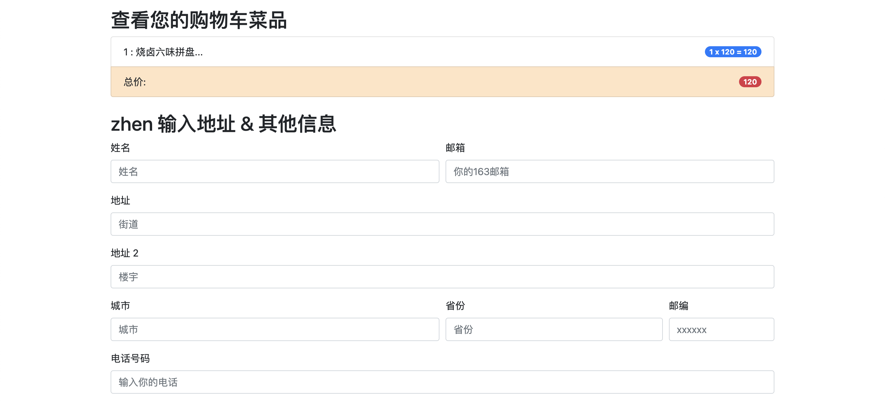
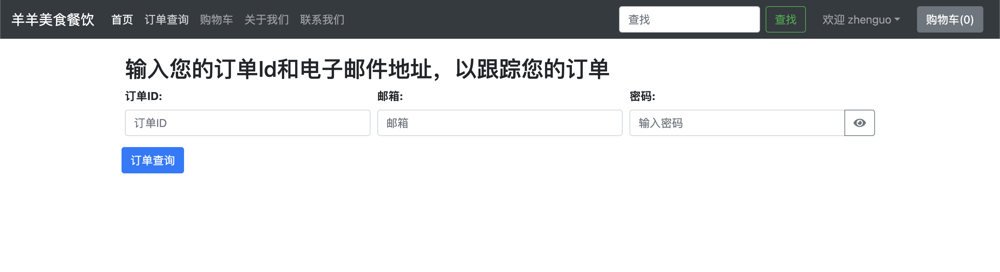
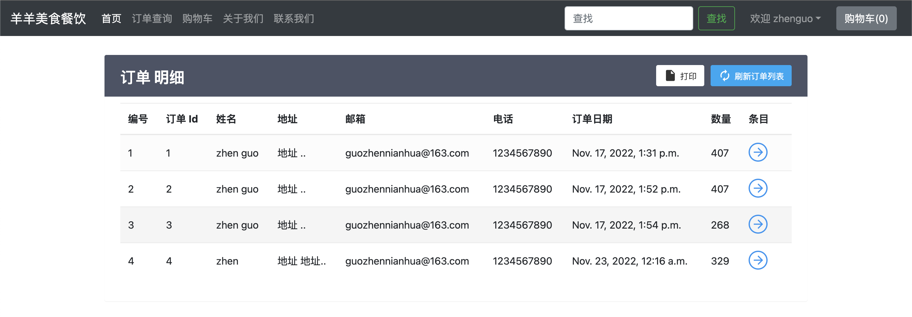
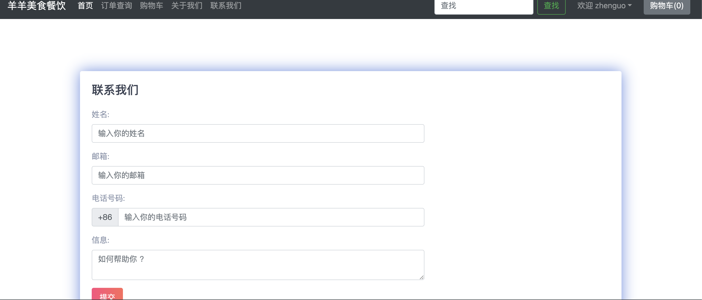

## Food Online Ordering System
url:https://github.com/gpc430/Food-Online-Ordering-System

This is a Django-based framework to develop a web page that allows users to order food online and check the status of the order. This tool helps customers to order food better, and businesses can also more easily show customers the food information. 

This is a Chinese online ordering system, which is divided into three different identities at the beginning of the page: customer, administrator and employee.

  

After logging in from the customer entrance, you can see different types of dishes, including: picture, name, price, quantity. At the top of the page, different foods can be filtered through the category and find buttons. After selecting the food, the customer can click the button of the shopping cart, and then the customer can see the added food in the cart.

  

After the customer has completed the selection of food, click the shopping cart to see the food they have selected, and then click checkout to see the checkout page. On this page, customers need to enter their personal information and address information, and finally choose to pay online or cash on delivery.

  

After the customer has paid, they can click the order Query button to view the order information. On this page, the customer can track the order by entering the order ID, email address and password.

  

In the order details page, customers can view each order number, ID, name, address, email, telephone, order date, quantity and food information.

  

On the contact page, customers can enter their name, email address and phone number to make suggestions about the restaurant or the food.

  

