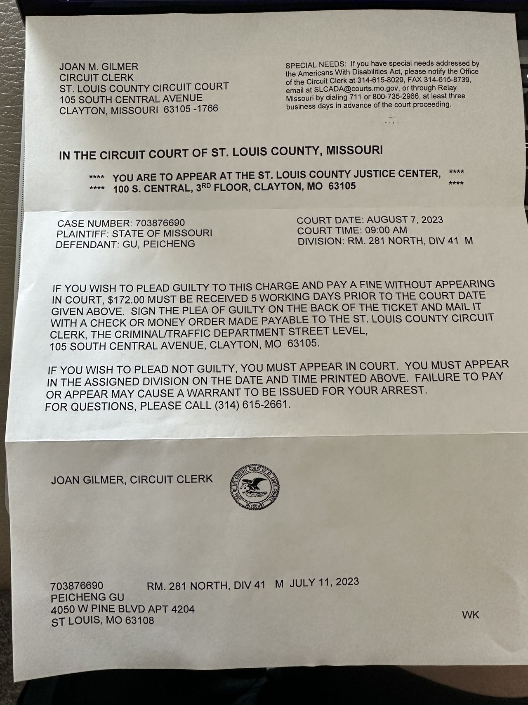

## Food Online Ordering System
This is a Django-based framework to develop a web page that allows users to order food online and check the status of the order. This tool helps customers to order food better, and businesses can also more easily show customers the food information. 

